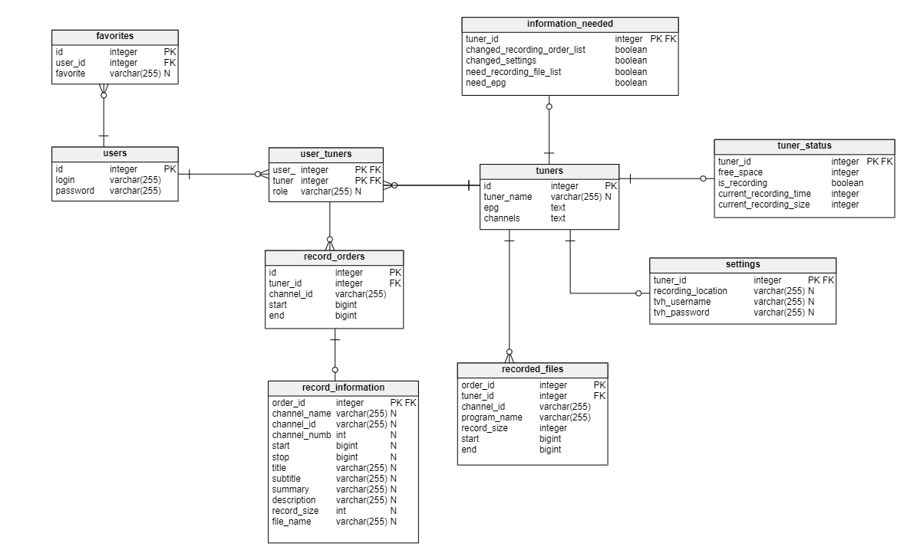

# Remotely-managed DVB-T Tuner - backend 

## Project structure
```
.
|─ documentation/
|─ misc/
|─ src/
  |─ api/                 
    |─ channels.py
    |─ epg.py
    |─ favorites.py
    |─ heartbeat.py
    |─ orders.py
    |─ recorded.py
    |─ settings.py
    |─ status.py
    |─ tuner.py
  |─ auth/                 
    |─ auth.py
  |─ database/
    |─ create/
    |─ utility/
    |─ db_manager.py
    |─ db_model.py
  |─ app.py
```

## Local development
```python
pip install -r requirements.txt
set FLASK_APP=app.py
set FLASK_ENV=development
flask run
```

## Format code
To format code use:
```
black 'filename'
```
or if you want to format all files
```
black .
```

## Database Scheme



## Endpoints

Currently avalible + planned endpoints
| endpoint                |  arguments             | type  | description                                       | returned values
| -                       | -                      | -     | -                                                 |  - 
| **Auth API**            |                        |       |                                                   |
| `/login/`               |                        | GET   | auth endpoint to login                            | {"status": boolean, "tuner_ids": []}
| `/register/`            |                        | POST  | auth endpoint to register account                 | {"status": boolean, "text": text}
| **Tuner API**           |                        |       |                                                   |
| `/tuner/create`         | tuner_name             | POST  | create new tuner                                  | text
| `/tuner/invite/add`     | user, tuner_id         | POST  | invite user to a tuner                            | text
| `/tuner/invite/accept`  | user, tuner_id         | POST  | accept invite to a tuner                          | text
| `/tuner/invite/decline` | user, tuner_id         | POST  | decline invite to a tuner                         | text
| `/tuner/users/remove`   | user, tuner_id         | POST  | remove user from a tuner                          | text
| `/tuner/users/list`     | tuner_id               | POST  | get list of users of a tuner                      | [[id, user, role], ...]
| `/tuner/list`           |                        | POST  | get list of tuners of a user                      | [[id, tuner, role], ...] 
| **Order API**           |                        |       |                                                   |
| `/orders`               | id, body(Orders)       | POST  | post a list of orders of a tuner                  | {"ids": [id, id, ..], "msg": text}
| `/orders`               | id                     | GET   | get a list of orders of a tuner                   | [{RecordInformation()}, {RecordInformation()}, ..]
| `/orders`               | tuner_id, order_id     | DEL   | remove an order from a tuner                      | text
| **Channels API**        |                        |       |                                                   |
| `/channels`             | id, body(Channel)      | POST  | post a list of channels of a tuner                | text
| `/channels`             | id                     | GET   | get a list of channels of a tuner                 | [{Channel()}, {Channel()}, ..]
| **EPG API**             |                        |       |                                                   |
| `/epg`                  | id, body(EPG)          | POST  | post an EPG of a tuner                            | text
| `/epg`                  | id                     | GET   | get an EPG of a tuner                             | [{EPG()}, {EPG()}, ..]
| **Status API**          |                        |       |                                                   |
| `/status`               | id, body(TunerStatus)  | POST  | post a status of a tuner                          | text
| `/status`               | id                     | GET   | get a status of a tuner                           | {TunerStatus()}
| **Settings API**        |                        |       |                                                   |
| `/settings`             | id, body(Settings)     | POST  | post settings of a tuner                          | text
| `/settings`             | id                     | GET   | get settings of a tuner                           | {Settings()}
| **Recorded API**        |                        |       |                                                   |
| `/recorded`             | id, body(RecordedFiles)| POST  | post recorded files of a tuner                    | {"posted_ids": [id, id, ..], "not_posted": [id, id, ..]}
| `/recorded`             | id                     | GET   | get recorded files of a tuner                     | {RecordedFiles()}
| **Heartbeat API**       |                        |       |                                                   |
| `/heartbeat`            | id                     | GET   | get heartbeat of a tuner                          | {InformationNeeded()}
| `/heartbeat/ask`        | id, information        | POST  | ask for specific information of heartbeat         | text
| `/heartbeat/provide`    | id, information        | POST  | provide for specific information of heartbeat     | text
| **Favorites API**       |                        |       |                                                   |
| `/favorites`            |                        | GET   | get favorites of a user                           | [[text], [text], ...]
| `/favorites`            | name                   | POST  | add favorite to a user                            | text
| `/favorites`            | name                   | DEL   | remove favorite from a user                       | text
| **Data generation**     |                        |       |                                                   |
| `/generate/database`    | name                   | POST  | generate database                                 | text
| `/generate/example`     | name                   | POST  | generate database with example data               | text