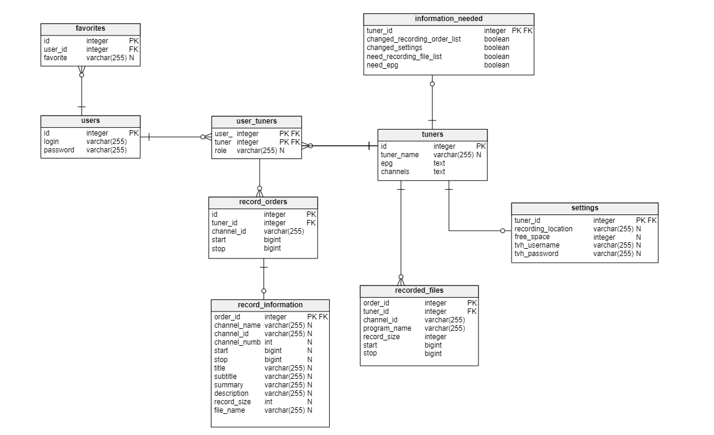

# Remotely-managed DVB-T Tuner - backend 

## Local development
```python
pip install -r requirements.txt
set FLASK_APP=app.py
set FLASK_ENV=development
flask run
```

## Format code
To format code use:
```
black .
```

## Database Scheme



## Endpoints

Currently avalible + planned endpoints
| endpoint                  | type  | description                                       | implemented
| -                         | -     | -                                                 |  - 
| **tuner endpoints**       |       |                                                   | 
| `/hearbeat?id=_`          | POST  | post information about tuner                      | ✅
| `/settings?id=_`          | GET   | get settings list for tuner                       | ✅
| `/orders?id=_`            | GET   | get a list of orders for tuner                    | ✅
| `/recorded?id=_`          | POST  | post a list of already recorded show for tuner    | ✅
| `/epg?id=_`               | POST  | post EPG of a tuner                               | ✅
| `/channels?id=_`          | POST  | post channels of a tuner                          | ✅
| **client endpoints**      |       |                                                   | 
| `/heartbeat?id=_`         | GET   | get information about tuner                       | ✅
| `/settings?id=_`          | POST  | post settings list for tuner                      | ✅
| `/orders?id=_`            | POST  | post orders for a tuner                           | ✅
| `/recorded?id=_`          | GET   | get a list of already recorded show for tuner     | ✅
| `/epg?id=_`               | GET   | get EPG of a tuner                                | ✅
| `/channels?id=_`          | GET   | get channels from a tuner                         | ✅
| **other endpoints**       |       |                                                   |
| `/generate/database`      | GET   | generate tables for database                      | ✅
| `/generate/example`       | GET   | generate tables + data for database               | ✅